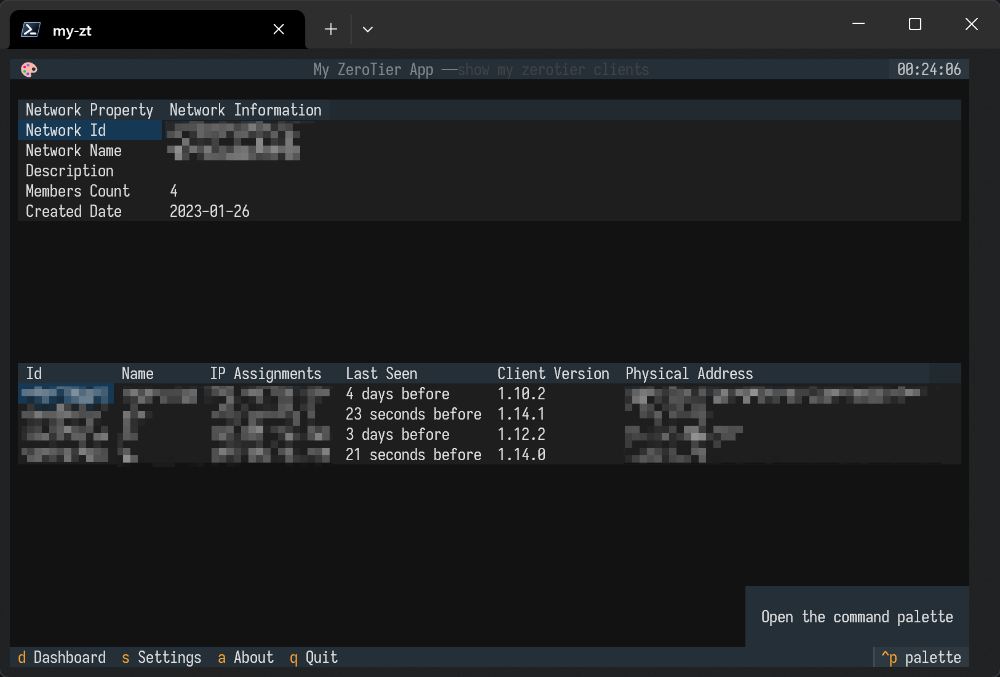

# my-zt-tui

This is a simple program to show your zerotier network and members. The program is written in python and is based on the textual library which is an interesting TUI library. If you like terminal based applications, you should have a try!

## Get Started

Clone the repo, cd into it, and run:

```sh
uv build
uv run my_zt
```

Of course, you should install the uv tool first. The configuration file is located at `~/.my-zt.yaml`.

## Screenshot



## TodoList

- [ ] Add full test case
- [ ] Add a loading indicator when data tables update
- [ ] Improve the ui design
- [ ] Add a tab when user has more than one network
- [ ] Add a bell informs the user that the network members is changing(online/offline/new member)
- [ ] Add more options like client refresh interval, etc.
